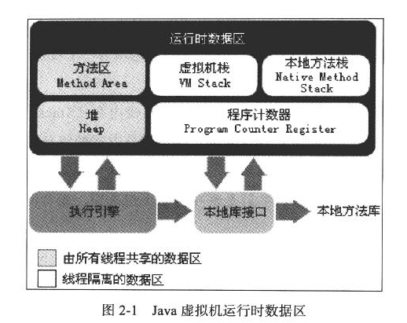
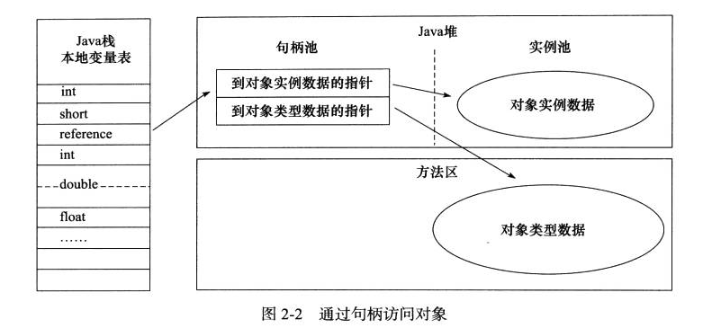
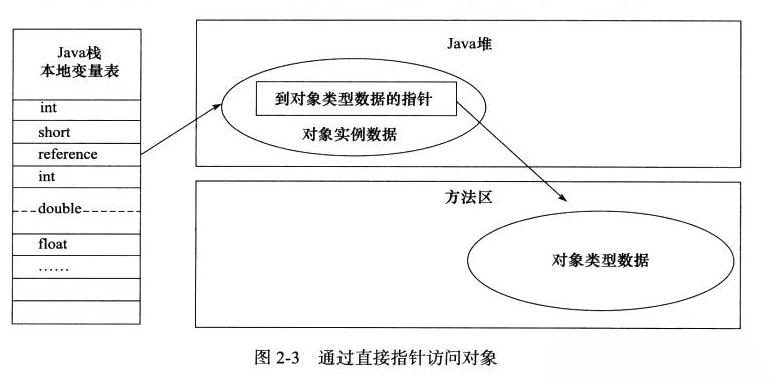

# 第二章 Java内存区域与内存溢出异常

## 2.2 运行时数据区域

Java运行时，会将管理的内存分为以上几个区域。

### 2.2.1 程序计数器(线程私有)

这个程序技术器的概念和计算机组成原理里边的程序计数器的概念差不多。

区别在于真实的程序计数器计数的是指令内存地址

Java程序技术器计数的是字节码的行号

如果线程正在执行Java的方法，那么程序计数器指示的就是字节码行号

如果线程正在执行Native方法，那么程序计数器的指示为空(Undefined)

**程序计数器这块内存区域，是唯一没有OutOfMemoryError**的情况

### 2.2.2 Java虚拟机栈(线程私有)

虚拟机栈描述的是Java方法执行的内存模型。Java程序员常说的栈就是Java虚拟机栈，或者指的是Java虚拟机栈里边的局部变量表。

这个部分的区域会报两种异常：一个是StackOverFlowError(虚拟机栈不可以动态扩展的情况)，一个是outofmemoryError异常(这个是虚拟机栈可以动态扩展的情况)

### 2.2.3 本地方法栈(线程私有)

本地方法栈描述描述的是本地方法执行的内存模型。本地方法栈也会抛出stackoverflowError和outofmemoryError。

### 2.2.4 Java堆(共享)

**Java堆是java虚拟机管理的内存中的最大一块。Java堆是被所有线程所共享的一块内存区域**

从内存回收的角度来看，现在收集器基本采用分代收集算法，按照这个方法分类，可以分为：新生代和老年代。

Java对可以处在物理内存不连续的区域，只要逻辑内存是连续的就好。

### 2.2.5 方法区(共享)

方法区用于存储已被虚拟机加载的类信息、常量、静态变量、即时编译器编译后的代码等数据

### 2.2.6 运行时常量池(共享)(属方法区)

运行时常量池是方法区的一部分，会抛出outofmemoryError异常

### 2.2.7 直接内存

直接内存并不是java运行时的数据区的一部分，也不是Java虚拟机规范中定义的内存区域。这部分内存也抛出outofmemory异常。

## 2.3 HotSpot虚拟机对象探秘

### 2.3.1 对象的创建

1. 虚拟机在遇到一条new指令时，首先将去检查这个指令的参数是否能够在常量池中定位到一个类的符号引用，并且检查这个符号引用代表的类是否被加载、解析、和初始化过。如果没有，那么必须先执行相应的类加载过程。

2. 在类加载检查通过后，接下来虚拟机将为新生对象分配内存。对象所需要的内存等大小在类加载完成后便可完全确定，为对象分配空间的任务等同于把一块确定大小的内存从Java堆中划分出来

   a. 内存分配方式：**(**有指针碰撞和空闲列表两种方式)

   b.  线程安全问题：可以采用CAS方式或者给每个线程划分TLAB，只有本地TLAB用完之后，再分配新的TLAB时需用CAS

3. 分配完内存后，虚拟机需要将分配到的内存空间都初始化为零值（不包括对象头），如果使用TLAB，这一项工作也可以提前至TLAB分配时进行。这一步操作保证了对象的实例字段在Java代码中可以不赋值就直接使用，程序能访问到这些字段的数据类型锁对应的零值。

4. 接下来，虚拟机要对对象进行必要的设置，例如这个对象是哪个类的实例、如何才能找到这个类的元素据信息、对象的哈希码、对象的GC分代年龄等信息。这些信息存放在对象的对象头之中。根据虚拟机当前的运行状态的不同，如是否启用偏向锁等，对象都会有不同的设置方式。

5. 上面的工作都完成后，从虚拟机角度来看，一个新的对象已经产生了，但从Java程序的角度来看，对象创建才刚刚开始——<init>方法还没执行，所有的字段都为零。所以，一般来说，执行new指令之后接着执行<init>方法，把对象按照程序员的意愿进行初始化，这样一个真正可用的对象才算完全产生出来。

### 2.3.2 对象的内存布局

**内存布局：**

1. 对象头
2. 实例数据
3. 对齐填充

#### 对象头(两部分内容)

1. 存储对象自身的运行时数据
2. 类型指针，指向它的类元数据的指针。虚拟机通过这个指针确定这个对象是哪个类的实例
3. 长度信息，这个是数组特有的

#### 实例数据

#### 对齐填充

### 2.3.3 对象的访问定位

1. 通过句柄访问实例对象：

   

2. 通过直接指针访问实例对象

   

   # 第三章 垃圾收集器与内存分配策略

   ## 3.1 确定对象生死

   ### 3.1.1 引用计数法

   **Java虚拟机不采取这个方法的原因：**

   ​	很难解决对象之间循环引用的问题

   ### 3.1.2 可达性分析算法

   在Java语言中，可以作为GC Roots的对象包括以下几种：
   
   1. 虚拟机栈中引用的对象
   2. 方法区中类静态属性引用的对象
   3. 方法区中常量引用的对象
   4. 本地方法栈中JNI引用的对象
   
   ### 3.1.3 再谈引用
   
   1. 强引用：类似 Object obj = new Object()这种，只要强引用还存在，Java垃圾收集器永远不会回收掉引用的对象
   2. 弱引用：用来描述有用但非必须的对象，在即将发生内存溢出的的时候，会对这部分引用的对象进行回收。回收完成后，还是没有足够内存，就会抛内存溢出异常。
   3. 虚引用：幽灵引用或者幻影引用，是最弱的一种引用关系，不对GC回收产生影响，在这个对象产生回收的时候，会受到一个系统通知。
   
   ### 3.1.4 生存还是死亡
   
   及时在可达性算法中，不可达的对象，也并非"非死不可"。
   
   **一个对象真正死亡，需要被标记两次：**
   
   1. 第一次标记：可达性算法显示不可达，会进行一次标记和筛选，筛选的条件是此对象是否有必要执行finalize()方法。当对象没有覆盖finalize()方法，或者finalize()方法已经被虚拟机调用过（**被调用过还在的话，说明finalize方法与GC Roots引用连发生了关联，不需要进行 标记**），虚拟机将这两种情况都视为”没有必要执行“。
   2. 第二次标记：这个对象如果被判定为有必要执行finallize()方法，那么这个对象会被放置在一个叫做F-Queue的队列中，并在稍后由一个虚拟机自动建立的、低优先级的Finalizer线程去执行它。这里的执行指的是虚拟机有机会触发这个方法，但不会承诺等待它执行结束，这样做的原因是，如果一个对象在finalize()方法中执行缓慢，或者发生了死循环，将何有可能阻塞F-Queue队列，队列中的其他对象永远处于等待，甚至导致整个内存回收系统崩溃。第二次标记发生在F-Queue队列中，如果虚拟机发现对象的finalize方法与GC root引用链发生了关联，那么第二次标记的时候就会移除出”即将回收“的集合。
   3. 经过这两次标记，对象真的要被回收了。
   
   ### 3.1.5 回收方法区
   
   
   
   

